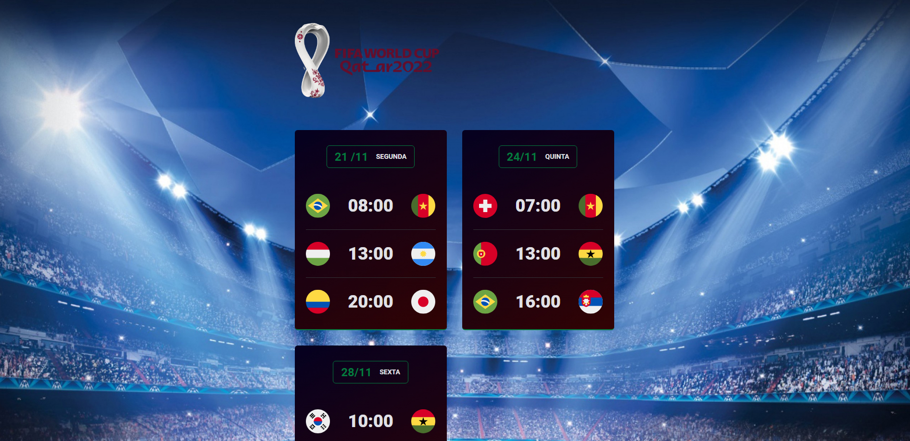

<h1 align="center"> NLW #10 Copa </h1>

Evento exclusivo e gratuito, promovido pela Rocketseat para ensino de tecnologias WEB.

  <a href="#-tecnologias">Tecnologias</a>&nbsp;&nbsp;&nbsp;|&nbsp;&nbsp;&nbsp;
  <a href="#-projeto">Projeto</a>&nbsp;&nbsp;&nbsp;|&nbsp;&nbsp;&nbsp;
  <a href="#-layout">Layout</a>&nbsp;&nbsp;&nbsp;|&nbsp;&nbsp;&nbsp;
  <a href="#memo-licença">Licença</a>

  

 

  

## 🚀 Tecnologias

Esse projeto foi desenvolvido com as seguintes tecnologias:

- HTML e CSS
- JavaScript 
- Git e Github

## 💻 Projeto

Calendário da Copa é um projeto com demonstração de algumas datas dos jogos de 2022.

## 🔖 Layout

Você pode visualizar o layout do projeto através do link [🔗 Calendario Copa 2022 ](https://lucienefreitas.github.io/NLW_Copa/)

## Licença:

Esse projeto está sob a licença MIT.

---

Feito com ♥ by Luciene Freitas 
